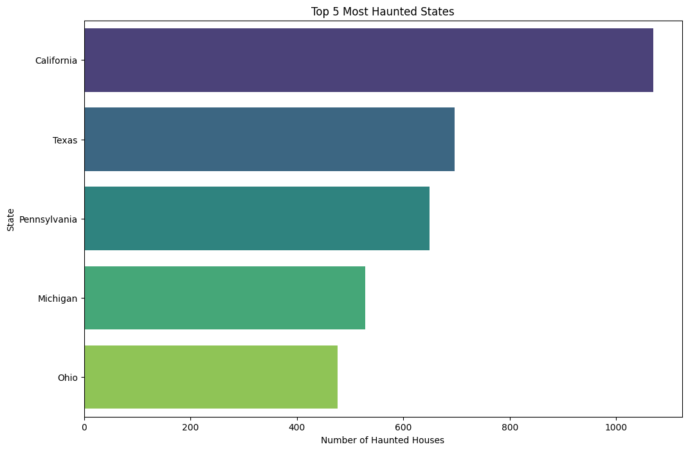
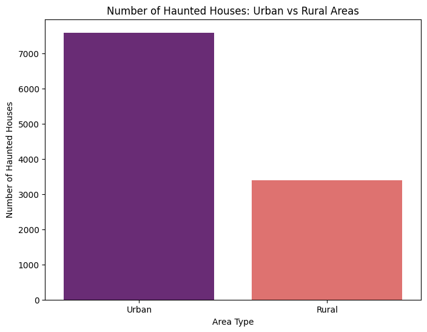
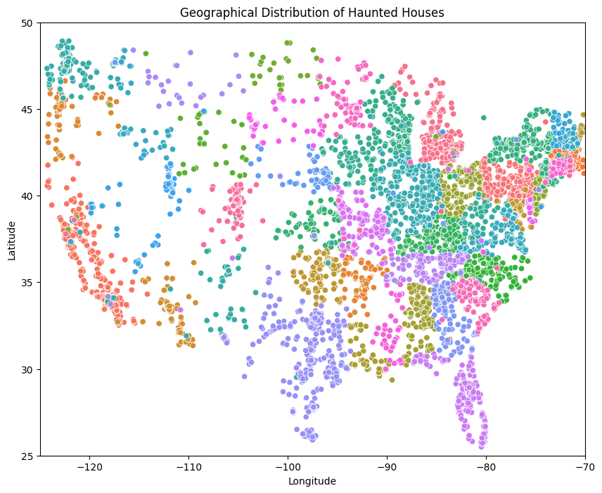
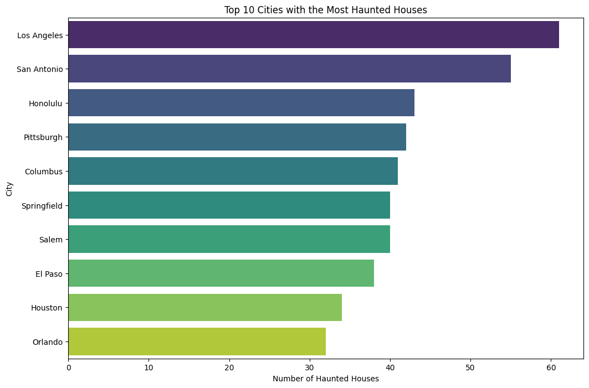
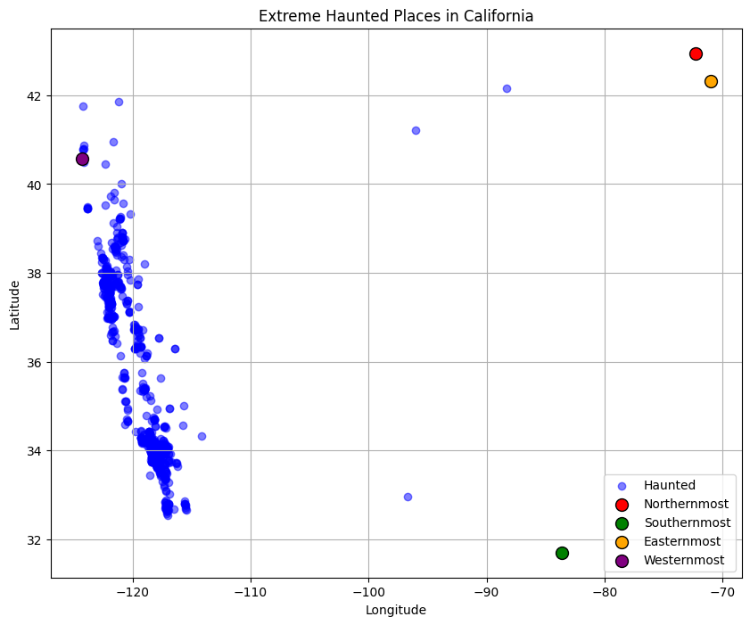
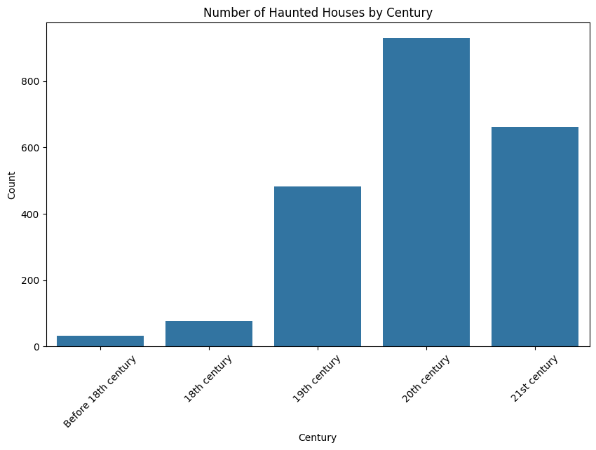
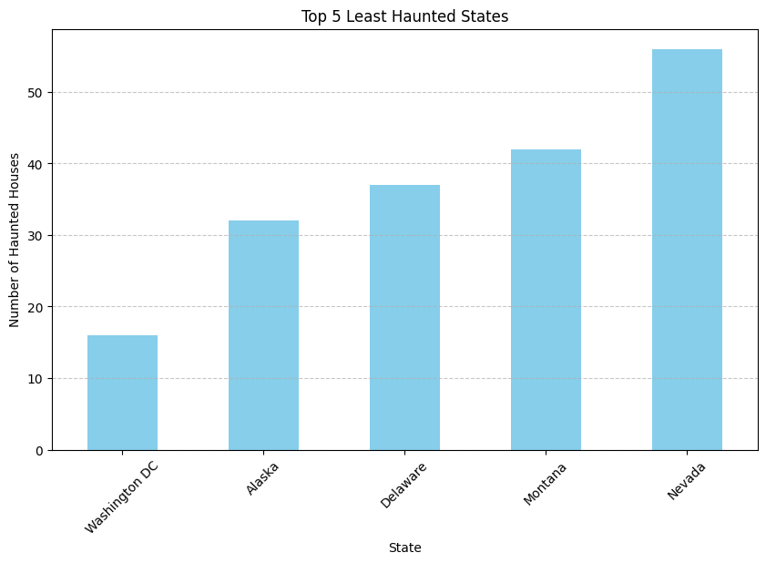
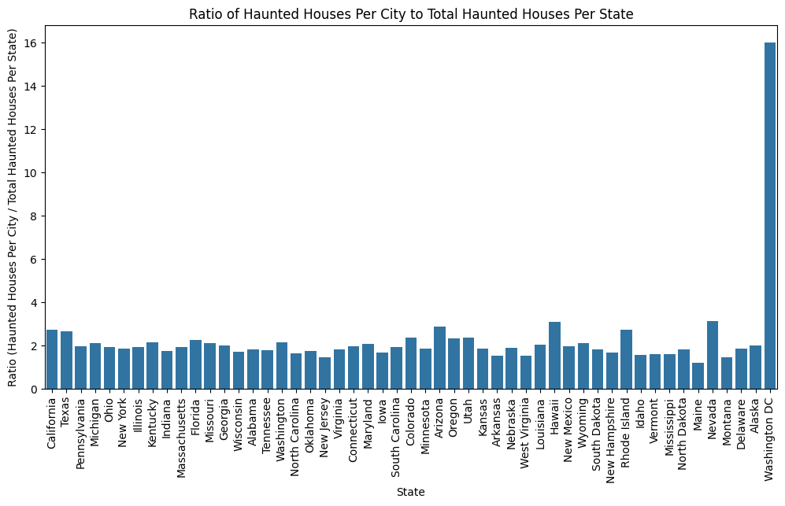
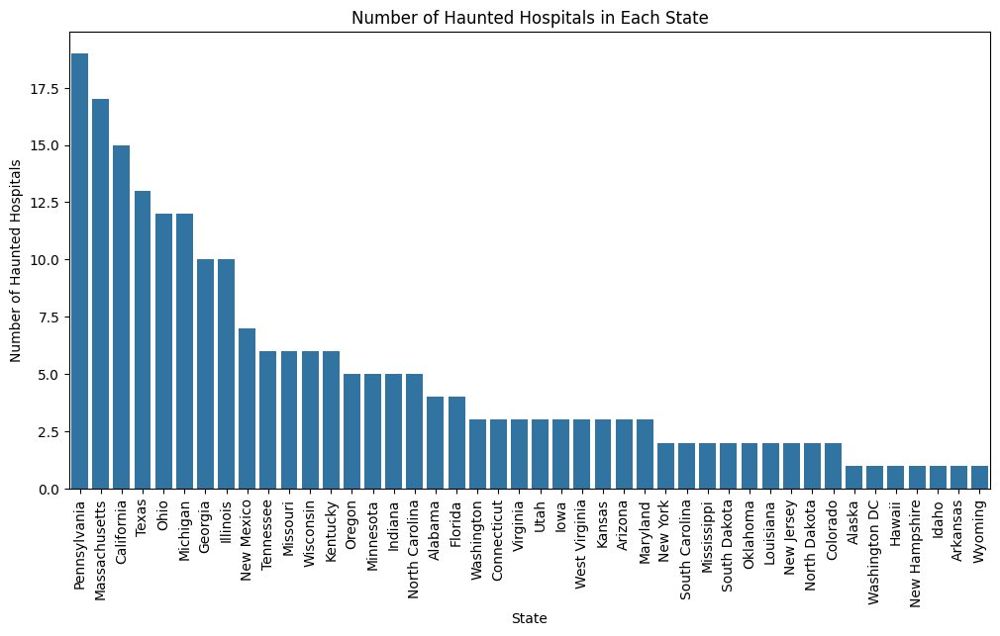
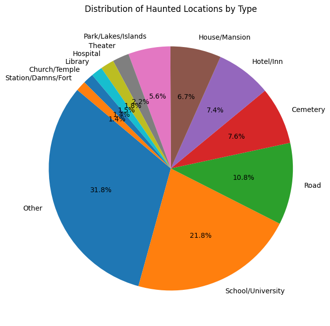

## Dataset

[Haunted Places](https://www.kaggle.com/datasets/sujaykapadnis/haunted-places)

## Why did I chose this dataset?

I chose this dataset because I am a big fan of horror/thriller movies. I always wanted to know what places were haunted and where were they clustered together.

## Progress

- [x] Picked dataset
- [x] Defined 10 questions
- [x] Answered 10 questions using Pandas
- [x] Added at least one data visualization (using Matplotlib and/or Seaborn) to each single question
- [ ] Prepared presentation slides to present at graduation

## Questions

- [x] Question 1: Which states have the highest concentration of haunted places?

  - Answer: California, Texas, Pennsylvania, Michigan, Ohio
  - Visualization: 

- [x] Question 2: Are haunted places more common in urban areas (cities) or rural areas?

  - Answer: Urban
  - Visualization: 

- [x] Question 3: Are there any clusters of haunted places?

  - Answer: Yes, more clustered on the east coast
  - Visualization: 

- [x] Question 4: Top 10 Cities with the most haunted places?

  - Answer: LA, San Antonia, Honolulu, Pittsburgh, Columbus, Springfield, Salem, El Paso, Houston, Orlando
  - Visualization: 

- [x] Question 5: What are the northernmost, southernmost, easternmost, and westernmost haunted places within California?

  - Answer:
  - Visualization: 

- [x] Question 6: What time period was most haunted?

  - Answer: 20th century -> 1900s
  - Visualization: 

- [x] Question 7: What are the least haunted states?

  - Answer: Washington DC, Alaska, Delaware, Montana, Nevada
  - Visualization: 

- [x] Question 8: How does the number of haunted places in each city compare to the total number of haunted places in the state where the city is located?

  - Answer: About the same except for DC because it is a territory
  - Visualization: 

- [x] Question 9: How many haunted hospitals are there in each state?

  - Answer: Pennsylvania has 18 haunted hospitals
  - Visualization: 

- [x] Question 10: What is a distribution of the types of haunted places?
  - Answer: 21% Schools, 10% Streets, 7.6% Cementery, 7% Hotels, 6.7% Houses, 31% Other (Very Specific Places)
  - Visualization: 
