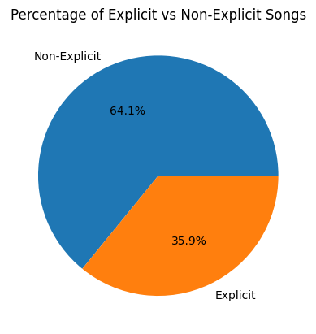

## Kevin Cao: Async-Blue Final Project

## Dataset

[Most Streamed Spotify Songs 2024](https://www.kaggle.com/datasets/nelgiriyewithana/most-streamed-spotify-songs-2024?resource=download)

## Why did I chose this dataset?

I chose this dataset because I enjoy listening to music on Spotify.

## Progress

- [ ] Picked dataset
- [ ] Defined 10 questions
- [ ] Answered 10 questions using Pandas
- [ ] Added at least one data visualization (using Matplotlib and/or Seaborn) to each single question
- [ ] Prepared presentation slides to present at graduation

## Questions

- [ ] Question 1: What percentage of the songs are explicit?

  - Answer: 35.9%
  - Visualization: 

- [ ] Question 2: How do Spotify streams compare to YouTube views across tracks?

  - Answer: [Placeholder for answer]
  - Visualization: 

- [ ] Question 3: What is the distribution of Shazam counts for tracks with high Spotify popularity?

  - Answer: [Placeholder for answer]
  - Visualization: 

- [ ] Question 4: Which tracks have the highest number of TikTok posts?

  - Answer: [Placeholder for answer]
  - Visualization: 

- [ ] Question 5: Which artist has the highest average Spotify streams per track?

  - Answer: [Placeholder for answer]
  - Visualization: 

- [ ] Question 6: Which artists have the most tracks in the top 100 all-time rank?

  - Answer: [Placeholder for answer]
  - Visualization: 

- [ ] Question 7: Which tracks have the most AirPlay spins?

  - Answer: [Placeholder for answer]
  - Visualization: 

- [ ] Question 8: How does the track score differ between tracks with high versus low Spotify playlist reach?

  - Answer: [Placeholder for answer]
  - Visualization: 

- [ ] Question 9: What trends can be observed in the number of TikTok posts over different release years?

  - Answer: [Placeholder for answer]
  - Visualization: 

- [ ] Question 10: What are the average YouTube likes and TikTok likes for tracks that have been included in the top 10 Spotify playlists?
  - Answer: [Placeholder for answer]
  - Visualization: 
